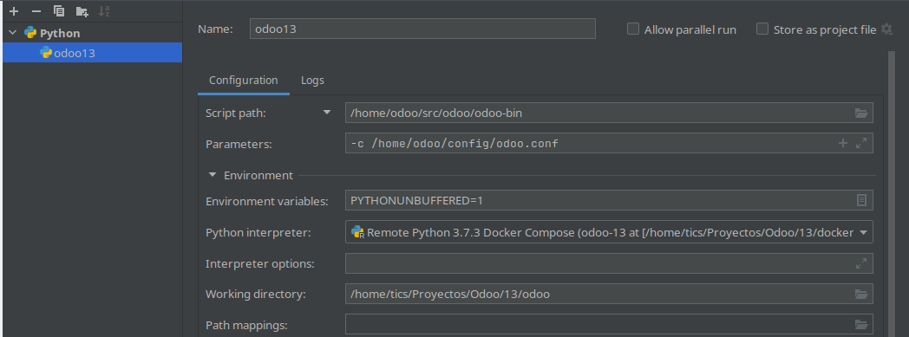

# TEST NIIF ODOO 13
Este proyecto crea el ambiente para probar el modulo l10n_ec_niif de @celm1990  en Odoo13

## Requerimientos
Instalar docker y docker-compose para poder ejecutar el conatainer

## Como se usa
Acceder a la carpeta **docker-compose** y levantar el servicio.

>`cd docker-compose`
>
>`docker-compose up -d`

## Nota
Para ejecutar en el IDE Pycharm Professional comentar la linea `entrypoint: ["python3", "/home/odoo/src/odoo/odoo-bin", "-c", "/home/odoo/config/odoo.conf"]` del archivo docker-compose.yml y realizar la siguiente configuracion:.

